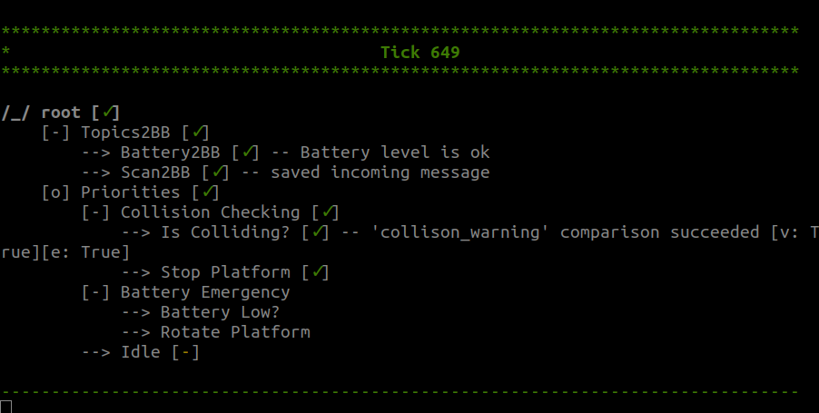
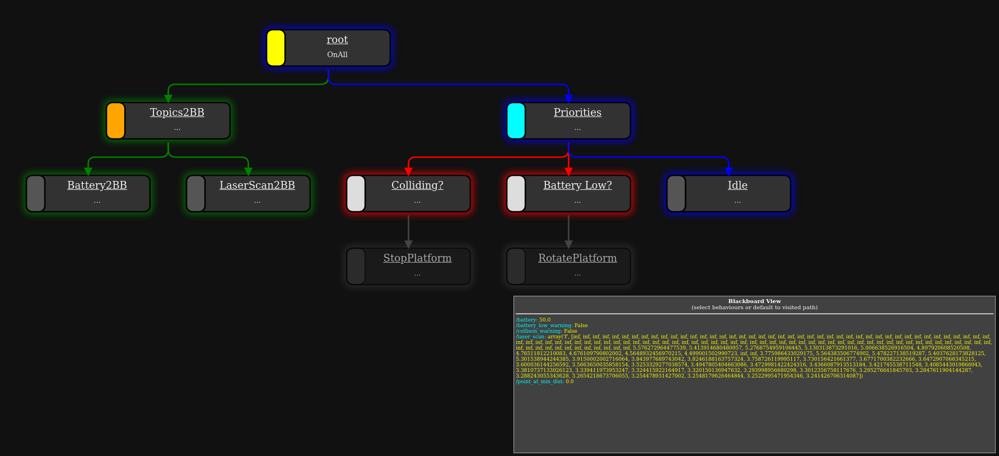

# WS23_AST_Assignment_BehaviorTree_StateMachine

## Overview:

In this assignment, we will explore the implementation of behavior trees and state machines to establish primary safety features for a robot. These includes situations like the battery level falling below a certain threshold and avoiding potential collisions.

State machines are used to co-ordinate between different tasks in robots, which allows to describe the task and the transition conditions. It operates in a sequential manner. SMACH(State Machine) is one of the framework which facilitates creating and managing state machines. SMACH is ROS independent, and 'executive_smach' provides integration with ROS. We will be using 'executive_smach' to implement state machine.

Behavior trees are used to define hierarchical structures of behaviors, which are designed to be adaptable and modular. The design considerations allows for defining transitions between behaviors. The majority of implementations of behavior trees in robotics are using 'BehaviorTree.CPP' in cpp and 'py_trees' in python. 'py_trees_ros' is a wrapper for 'py_trees' to integrate it with ROS. We will be using 'py_trees_ros' to implement behavior trees. 

## Description of the files:

1. **safety_monitoring_SMACH.py**: is a state machine implementation which defines states and the transition conditions between them

2. **behaviors.py**: all behaviors that can be used in behavior tree can be described in this script

3. **safety_monitoring_BT.py**: is a behavior tree composition implementation which composes different behaviors and decides the transitions between behaviors. 
Please find the sample visualisation for safety_monitoring when the robot is about to collide in ASCII format below



Another sample visualisation of similar task, but with slightly different strucutre can be found below for better intuition of behavior tree



## Task:

- To complete the scripts in **safety_monitoring_BT.py**, **behaviors.py**, and **safety_monitoring_SMACH.py** according to the instructions given in the scripts
- To integrate these scripts into a ROS2 python package, with two launch files to run both the implementations
- The [SMACH tutorials](https://wiki.ros.org/smach/Tutorials), [py_trees documentation](https://py-trees.readthedocs.io/en/devel/), and [py_trees_ros tutorials](https://py-trees-ros-tutorials.readthedocs.io/en/release-2.1.x/tutorials.html) will be helpful for your implementation

## Setting up your system:

1. Please setup Ubuntu 22.04, ROS2 humble, and Robile simulation if not already done using the [documentation](https://robile-amr.readthedocs.io/en/humble/)

2. Install the py-trees-ros and smach packages,
    ```
    sudo apt-get  install ros-humble-py-trees ros-humble-py-trees-ros ros-humble-py-trees-ros-interfaces xcb ros-humble-smach*
    ```

3. Create a new ROS2 python package and integrate the provided scripts with it


## Tips while running scripts:

1. Steps:
    - Run robile in simulation
    - Create and launch, for example, 'safety_monitoring_BT.launch.py' or 'safety_monitoring_SMACH.launch.py' and verify the desired behavior

2. As the battery percentage is not readily available in simulation, please publish the battery percentage values in a new terminal. Considering the topic being subscribed is `/battery_voltage`, publish the battery percentage value of your choice
    ```  
    ros2 topic  pub /battery_voltage std_msgs/msg/Float32  data:\ 50.0\ 
    ```

3. Though behavior tree visualization is not released on ROS2 humble yet, the changes in the behavior tree can be viewed by running the following command, which is helpful for debugging
    ```
    py-trees-tree-watcher
    ```

4. 4. It is recommended to implement only the rotation behavior when battery percentage is low in both appraoches. Once it is functional, integrating also the collison avoidance will help save the time
